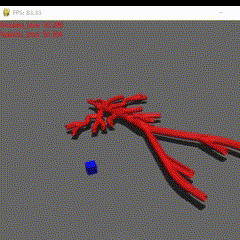

# Mujoco Pygame Interface
Provide pygame interface of mujoco to guys who familiar to pygame rather than mujoco-builtin viewer.

    

# Features
- `pygame` interface rendering and interacting.
- Easy to edit your own events by pygame events API.
- Fast building your own projects with physics engine.

# Usage
Install requirement librarys by:
    
    pip install -r requirements.txt

Build up your own Mujoco physics envirment using `xml` or `dm_control.mjcf` and load them into `mujoco.Physics` class to get an instance. You can get help from [dm_control documents](https://github.com/deepmind/dm_control) by DeepMind. 

    with open("my_physics.xml","r") as f :
            my_physics_xml = f.read()
    my_physics_instance = MujocoPhysics.from_xml_string(my_physics_xml)

Then Initialize a `MjViewer` instance and start your rendering own game scence.

    viewver = MjViewer()
    viewver.realtime_render(my_physics_instance, framerate=120)
    
